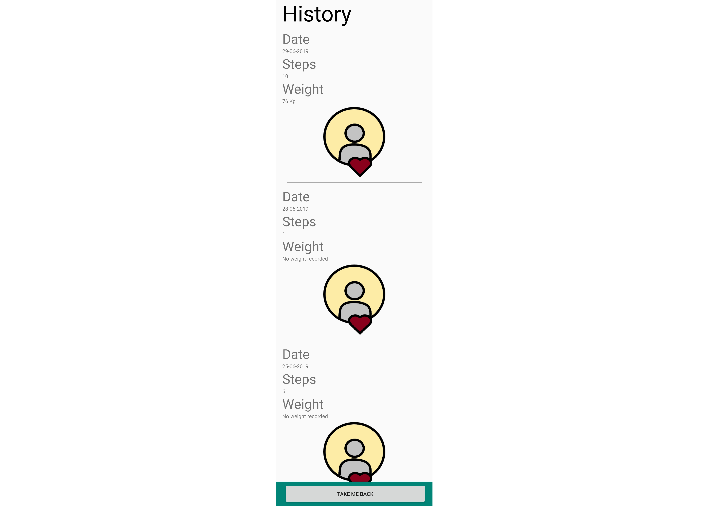

# Fitness application android studio
 As part of a varsity assignment, I created a fitness application that tracks a user's steps, weight, and fitness progress.

This image depicts the initial login screen (left), which makes use of the Google sign-in API for easier access. If the user is new to the app, the register screen (right) will appear for the user to enter his/her details.

This image depicts the four navigation screens, namely steps, weight, camera, and goals. The steps screen displays a pie chart of the user's step progress for the day, as well as a graph of the user's step and weight history. Users can record their weight on the next screen, and it will automatically calculate their BMI. The app also allows users to take photos to track changes in their physical appearance as they make progress with their fitness goals. Finally, users can set their daily step target and weight goal, and change the measurement unit. The app will display the profile pictures of users' Google accounts through the Google API. They will also be able to log out from their Google accounts and delete their data from this screen.

This image depicts the user's step and weight history along with the dates on which they were recorded and the accompanying photos added by the user. If a photo was not added, it will show the default image.

